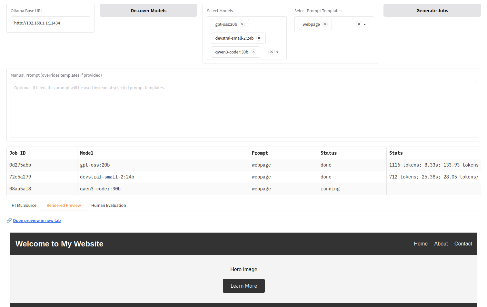

# 🦙 gr-modelbench

A **Gradio-based benchmarking and evaluation tool** for generating HTML pages with **remote Ollama models**, running **batch (“batch mode”) generations**, previewing results, and performing **human evaluations** with structured scoring.



Designed for:
- Comparing multiple LLMs
- Comparing multiple prompt templates
- Manual prompt experimentation
- Human-in-the-loop evaluation
- Reproducible logging and analysis

---

## ✨ Features

### 🔌 Remote Ollama Integration
- Connect to any remote Ollama instance via URL
- Discover available models dynamically
- Execute `generate` requests remotely

### 🧩 Batch Mode (Batch Generation)
- Select **multiple models**
- Select **multiple prompt templates**
- Or provide a **manual prompt** (overrides templates)
- Jobs run **sequentially in the background**
- Track status per job (pending / running / done / error)

### 🖥️ HTML Rendering
- View raw generated HTML
- Render HTML preview safely
- Open preview in a **new browser tab**
- If fenced HTML exists, only fenced content is rendered

### 🧑‍⚖️ Human Evaluation
- Structured 5-point evaluation scales for:
  - Color & Typography
  - Layout & Structure
  - Correctness
  - Functionality
- Clear criteria embedded directly in UI
- Free-form qualitative feedback
- Evaluations stored per generation run

### 📊 Experiment Logging
- Each generation gets a unique **UUID**
- Metrics logged in **EAV (entity–attribute–value)** format
- Logged attributes include:
  - Model name
  - Prompt template name
  - SHA256 hash of full prompt
  - Manual vs template prompt source
  - Tokens/sec
  - Eval count
  - Prompt count
  - Generation time
  - Random seed (when available)
- Append-only CSV logs for easy analysis

### 🧱 Modular Architecture
Code is split into focused modules:
- UI components
- Patch mode execution
- Rendering
- Prompt handling
- Evaluation logic
- Persistence & logging

This keeps the codebase **LLM-friendly**, maintainable, and extensible.

---

## 📁 Project Structure

```text
.
├── main.py                 # App entry point
├── ui_components.py        # Gradio UI layout
├── patch_mode.py           # Batch job creation & execution
├── ollama.py               # Ollama API integration
├── prompts.py              # Prompt templates & builder
├── rendering.py            # HTML preview handling
├── evaluation.py           # Save human evaluations
├── evaluation_scales.py    # Scoring scales & criteria
├── persistence.py          # Persist Ollama URL, settings
├── utils.py                # Helpers (HTML fence extraction, hashing, etc.)
├── previews/               # Generated HTML previews
├── log.csv                 # Generation metrics (EAV format)
├── prompt.yml              # Prompt template definitions
└── README.md
